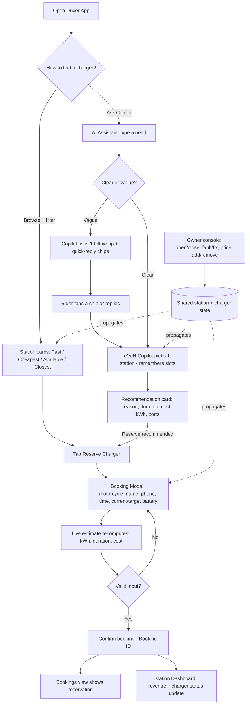

# Prototype Plan: eVcN

*Directs the design/prototype phase. The eVcN POC in this repo (`eVcN-PoC/`) is the prototype — a high-fidelity, clickable React app that simulates the full experience on faked data so we can test the concept with riders and owners before building live infrastructure.*

## User Flow Diagram
The **happy path** the prototype must demonstrate (this is the built-in "Demo script" in `App.jsx`):

```
Driver App  →  AI Assistant  →  Recommendation  →  Booking Modal  →  Confirmation  →  Dashboard / Bookings
  (browse)       (ask)            (one pick)         (details)         (Booking ID)      (reflects update)
```



*   **Why it matters:** the experience is a *sequence*, not a single screen. The flow ensures the conversational clarify branch, error states (invalid phone, target ≤ current battery, closed/full station disabling Reserve), and the confirmation are not skipped — and that owner edits visibly reach the rider side.
*   **Screens to mock (all built):** Driver App (hero + map + filters + station cards), AI Assistant (chat + example prompts + **clarifying question with quick-reply chips** + recommendation card), Booking Modal (form + live estimate + success state), Station Dashboard / **owner console** (metrics + live charts + **Station Controls** + charger table with **actions** + data-driven insights), Bookings table.

## Frontend (FE) Prototype Focus
*   **Level of fidelity:** **High.** Production-grade React + Vite + Tailwind UI, with Recharts data viz, lucide-react icons, responsive layout, and accessibility built in (focus-trapped modal, `aria` labels, keyboard nav, `aria-live` typing indicator). This is deliberately high-fidelity because we're testing *trust and clarity*, which low-fi wireframes can't surface.
*   **Key interactions to feel real:**
    *   **Conversational ask → guided answer:** a clear prompt yields an immediate recommendation; a vague one ("I need to charge") triggers a short "eVcN Copilot is thinking…" beat (~400 ms to ask, ~700 ms to recommend) then **one clarifying question with tappable quick replies** (Nearest / Cheapest / Fastest / Available now / Just recommend one). The Copilot **remembers** the answer, then shows a recommendation card with a *reason* and a **Reserve recommended charger** button. Typo'd greetings ("helu") are still read as greetings.
    *   **Interactive owner console:** on the Station Dashboard the owner can **open/close** a station, mark a charger **faulty/fixed/free**, **edit price per kWh**, and **add/remove** chargers — and the **live utilization chart + data-driven AI insights** update with the data.
    *   **Filters & map:** toggling Fast / Cheapest / Available now / Closest re-sorts/filters station cards instantly; HCMC map shows open (green) vs. closed (slate) pins by district.
    *   **Live estimate:** in the booking modal, changing current/target battery or station instantly recomputes kWh needed, charge duration, and VND cost — so the number feels responsive and honest.
    *   **State that persists & propagates (both directions):** confirming a booking decrements ports, flips a charger to "Reserved," and updates **Bookings** + **Dashboard** revenue; an **owner edit** (close a station, fault a charger, reprice) instantly changes what riders see, can book, and what the Copilot recommends — demonstrating the two-sided flywheel in one browser.
    *   **Owner insights:** asking "show station owner insights" switches the Copilot to SaaS-style operational tips (no driver reservation offered).
*   **Faked backend (intentionally hardcoded for the test):**
    *   **No real AI** — `eVcN Copilot` is a **conversational rule-based engine** (`src/lib/assistant.js`): `converse()` with slot memory + a clarify-when-vague flow + typo-tolerant greeting, not an LLM. Responses are deterministic.
    *   **Mock data** — 5 HCMC stations + 20 chargers + sample bookings/sessions/revenue (`src/data/mockData.js`); the map uses mock `mapPosition` percentages, not real geo.
    *   **Transparent estimate model** — `estimateCharging` in `src/lib/booking.js` (4 kWh battery; Standard 1.5 / Fast 3.5 / Ultra-fast 6 kW; price × kWh in VND).
    *   **Owner edits = shared state** — owner actions mutate the same `stations`/`chargers` state the rider side reads; `syncStationPorts` keeps port counts honest. No real charger hardware/OCPP.
    *   **Persistence** — `localStorage` only (best-effort), versioned; no server, payments, navigation, or auth.
*   **Impact:** the prototype is scoped to the **minimum experience needed to gather feedback** on the two riskiest assumptions — *do riders trust one recommendation (after at most one clarifying question) enough to reserve?* and *are the owner console controls the right ones, and is the live propagation trustworthy?* — without over-engineering the live OCPP/payment infrastructure the [PRD](06_prd.md) scopes for the V1 build.

## How to run the prototype
```bash
cd eVcN-PoC
npm install
npm run dev      # open the local Vite URL
npm test         # Vitest unit tests (assistant, booking, mockData, App)
```
**Suggested test script:** AI Assistant → type *"I need to charge"* → tap **Cheapest** when the Copilot asks → Reserve the recommended charger → enter motorcycle + battery details → Confirm → open the **owner console** (Station Dashboard), then **close** that station or mark a charger **faulty** → return to **Driver App** / **AI Assistant** and watch the station's availability and reservability change live.
